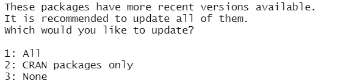
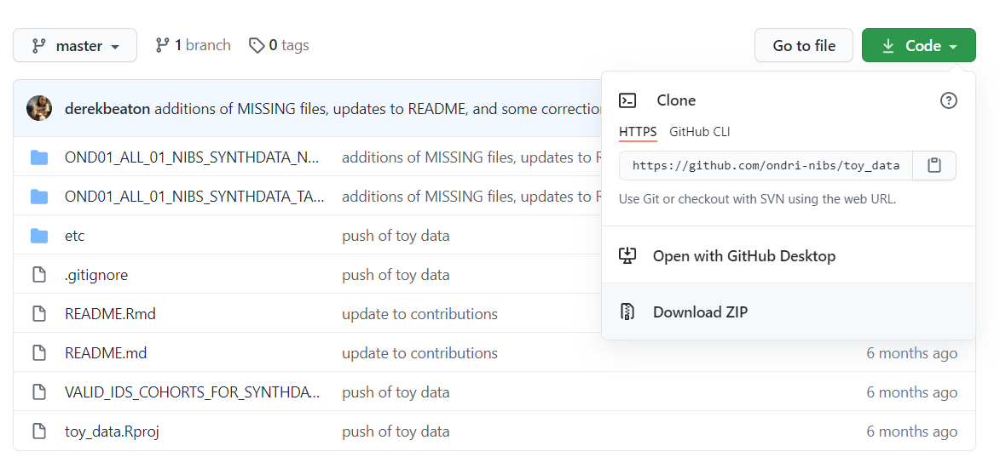

README
================
Logan Lim, Jedid Ahn, & Derek Beaton.
Updated as of April 09, 2021.

# ONDRI Standards R Package 

An R package with functions for checking standards on an ONDRI data
package.

<br>

-   Install [R](https://cran.r-project.org/) first and then
    [RStudio](https://rstudio.com/products/rstudio/download/). Please
    choose the correct installer carefully as it will depend on your
    computer’s operating system.

<br>

-   Download and install the package directly with the following lines
    of code:

<!-- -->

      if (!require("devtools")){
        install.packages("devtools")
      }
      devtools::install_github(repo = "ondri-nibs/ondri_standards_package")

If you get the following message in your RStudio console, please type 3.
<br><br> 

<br>
<hr>

# Glossary

Below is a convenient and comprehensive list of the checks available in
this package. It includes the name of the function that looks like
`checkColumnLabels`, and is immediately followed by a brief definition.

`checkColumnLabels(dictDF, dataDF)`: Check whether a DICT data frame’s
column labels match in exact order with the column names in the DATA
data frame, and that no column labels are duplicated.

`checkColumnNameSyntax(df)`: Check data frame for proper column name
syntax.

`checkDateFormat(dates)`: Check whether an input character vector
contains valid date format YYYYMMMDD.

`checkDirNames(dirNames)`: Check that directory names use alphanumerics
and underscores, and make sure first character is not a digit or
underscore.

`checkDirStructure(baseDir, dirStructure, recursive = T, exact = F)`:
Check whether or not directory matches specified structure. Also checks
a specified set of names in a directory against the list.files output.

`checkEncoding(filePath)`: Check whether a tabular csv file is encoded
in the broadly accepted formats of ASCII or UTF-8.

`checkForBlankCells(df)`: Check data frame for blank cells and NA.

`checkForColumnNameDuplicates(df)`: Check data frame for duplicate
column names (case insensitive).

`checkForCommas(df)`: Check data frame for commas.

`checkForCompressedFiles(dirPath)`: Check if a directory contains
compressed files.

`checkForDuplicateFileNames(dirPath)`: Check non-tabular directory for
duplicate files in different leveled folders, such as duplicate file
names in level 1 and level 2.

`checkForEncapsulation(df)`: Check data frame for properly closed
quotes.

`checkForFileTypes(fileExt, dirPath, recursive = F)`: Check for specific
file types in directories.

`checkForIDOverlap(df1, df2)`: Check for participant ID overlap between
2 data frames. In ONDRI case, the participant IDs in the DATA and
MISSING files should be checked for potential overlap.

`checkForRaggedRows(filePath)`: Check whether a tabular csv file
contains ragged rows.

`checkForSpecialCharacters(df)`: Check for special characters in a data
frame.

`checkForSpecialValues(filePath)`: Check whether a tabular csv file
contains special values such as NaN (not a number), Inf (infinity), -Inf
(negative infinity), or NULL (no value).

`checkForWhiteSpaces(df)`: Check for leading or trailing whitespaces in
a data frame.

`checkM_Pattern(df)`: Check the ^M\_ pattern in a data frame and count
the number of occurrences of each unique code.

`checkMissingCodes(dataVec, validMissingCodes = c("M_CB", "M_PI", "M_VR", "M_AE", "M_DNA", "M_TE", "M_NP", "M_ART", "M_TBC", "M_OTHER"))`:
Check whether a vector contains valid missing codes wherever a cell
starts with “M\_”.

`checkNumOfCharacters(df, k = 200)`: Check whether a data frame contains
less than k characters in each cell.

`compareDICTColumnLabels(dictDF, dataDF)`: Compare column labels in the
DICT data frame and the column names in the DATA data frame.

`compareParticipantFileNames(fileNamesVec, dirPath)`: Compare a vector
of file names (such as the FILENAME column in the level 3 FILELIST file)
and the literal contents of a directory (such as the level 3 DATAFILES
folder) and check whether they match exactly.

`compareREADMEFileNames(readmeDF, dirPath)`: Compare the file names in
the README file and the files in the directory containing the README
file.

<br>
<hr>

# Preamble

To test out the standards package functions yourself, please download
the toy data sets from the `ondri-nibs/toy_data` repository on GitHub:
<https://github.com/ondri-nibs/toy_data>

Click on “Download ZIP” as shown below and then unzip into your desired
folder. <br><br> 

<br>

Once unzipped, please retrieve the full directory paths of both the
tabular and non-tabular data packages. Examples of both directory paths
are provided below. Please note that slashes between directories could
be different for different operating systems.

**For convenience** we also provide a copy of those data packages in
this repository under `./etc/DATA/`. This also helps ensure that we can
automatically knit the RMarkdown file.

``` r
tabular_dir_path <- "./etc/DATA/OND01_ALL_01_NIBS_SYNTHDATA_TABULAR_2020JUL26_DATAPKG"

nontabular_dir_path <- "./etc/DATA/OND01_ALL_01_NIBS_SYNTHDATA_NONTABULAR_2020JUL26_DATAPKG"
```

<br>

Once the directory paths have been initialized, you can retrieve all
files of the tabular data package using the code below.

``` r
DATA_FILE <- paste0(tabular_dir_path, "/OND01_ALL_01_NIBS_SYNTHDATA_TABULAR_2020JUL26_DATA.csv")
DATA_DF <- read.csv(DATA_FILE, stringsAsFactors = FALSE)

DICT_FILE <- paste0(tabular_dir_path, "/OND01_ALL_01_NIBS_SYNTHDATA_TABULAR_2020JUL26_DICT.csv")
DICT_DF <- read.csv(DICT_FILE, stringsAsFactors = FALSE)

README_FILE <- paste0(tabular_dir_path, "/OND01_ALL_01_NIBS_SYNTHDATA_TABULAR_2020JUL26_README.csv")
README_DF <- read.csv(README_FILE, stringsAsFactors = FALSE)

MISSING_FILE <- paste0(tabular_dir_path, "/OND01_ALL_01_NIBS_SYNTHDATA_TABULAR_2020JUL26_MISSING.csv")
MISSING_DF <- read.csv(MISSING_FILE, stringsAsFactors = FALSE)
```

<br>

An example of reading in relevant files from the non-tabular data
package is provided below. The variable endings represent the level that
the file resides in.

``` r
DATA_FILE_1 <- paste0(nontabular_dir_path, "/OND01_ALL_01_NIBS_SYNTHDATA_NONTABULAR_2020JUL26_DATA.csv")
DATA_DF_1 <- read.csv(DATA_FILE_1, stringsAsFactors = FALSE)

DICT_FILE_1 <- paste0(nontabular_dir_path, "/OND01_ALL_01_NIBS_SYNTHDATA_NONTABULAR_2020JUL26_DATA.csv")
DICT_DF_1 <- read.csv(DICT_FILE_1, stringsAsFactors = FALSE)

README_FILE_1 <- paste0(nontabular_dir_path, "/OND01_ALL_01_NIBS_SYNTHDATA_NONTABULAR_2020JUL26_README.csv")
README_DF_1 <- read.csv(README_FILE_1, stringsAsFactors = FALSE)

MISSING_FILE_1 <- paste0(nontabular_dir_path, "/OND01_ALL_01_NIBS_SYNTHDATA_NONTABULAR_2020JUL26_MISSING.csv")
MISSING_DF_1 <- read.csv(MISSING_FILE_1, stringsAsFactors = FALSE)

README_FILE_2 <- paste0(nontabular_dir_path, "/SABRE_NIIs/OND01_ALL_01_NIBS_SYNTHDATA_NONTABULAR_SABRE_NIIs_2020JUL26_README.csv")
README_DF_2 <- read.csv(README_FILE_2, stringsAsFactors = FALSE)

MISSING_FILE_2 <- paste0(nontabular_dir_path, "/SABRE_NIIs/OND01_ALL_01_NIBS_SYNTHDATA_NONTABULAR_SABRE_NIIs_2020JUL26_MISSING.csv")
MISSING_DF_2 <- read.csv(MISSING_FILE_2, stringsAsFactors = FALSE)

FILELIST_FILE_3 <- paste0(nontabular_dir_path, "/SABRE_NIIs/DATAFILES/OND01_ALL_01_NIBS_SYNTHDATA_NONTABULAR_SABRE_NIIs_2020JUL26_FILELIST.csv")
FILELIST_DF_3 <- read.csv(FILELIST_FILE_3, stringsAsFactors = FALSE)
```

<br>
<hr>

# Introduction

Each check function returns an S4 object of type CheckResult. It
contains the following slots that can be accessed with ‘@’:

-   name
    -   character. Name of the check that was performed.
-   pass
    -   logical. True if the check passes, false otherwise.
-   msg
    -   character. Associated messages returned from a check.
-   data
    -   list. Associated data returned from a check.

<br>

For example, if `check.res` is a CheckResult object, then we can access
the `msg` with `check.res@msg`. However, to retrieve the data object as
a data.frame, it is recommended to use `has.data(check.res)` and
`get.data(check.res)` to access data from a CheckResult object, since
some CheckResult subclasses may implement their own means of returning
data to a user in a more sensible way. However, by default, `get.data`
will return the `CheckResult@data` as a `data.frame`. If accessing the
data object directly better suits your purposes, you are free to do so.

``` r
pkg_prefix <- "OND01_ALL_01_NIBS_SYNTHDATA_TABULAR_2020JUL26_"
checkDirStructure(baseDir = tabular_dir_path,
                  dirStructure = paste0(pkg_prefix, c("DATA.csv", "DICT.csv", "README.csv", "MISSING.csv")),
                  recursive = TRUE)
```

<br>

If you wish to perform multiple checks at once, you can string them
together using `combineChecks()`.

``` r
checkValues <- function(dataDF) {
  check.res <- 
    combineChecks(
      checkColumnNameSyntax(df = dataDF),
      checkForColumnNameDuplicates(df = dataDF),
      checkForBlankCells(df = dataDF),
      # Check for commas in data frame
      checkForCommas(df = dataDF),
      checkForEncapsulation(df = dataDF[sapply(dataDF, class) == 'character']),
      # Check for leading or trailing white spaces
      checkForWhiteSpaces(df = dataDF[sapply(dataDF, class) == 'character'])
  )
  return (check.res)
}

checkValues(DATA_DF)
```

    ## An object of class "CheckResult"
    ## Slot "name":
    ## [1] "checkColumnNameSyntax"        "checkForColumnNameDuplicates"
    ## [3] "checkForBlankCells"           "checkForCommas"              
    ## [5] "checkForEncapsulation"        "checkForWhiteSpaces"         
    ## 
    ## Slot "pass":
    ## [1] FALSE  TRUE  TRUE  TRUE  TRUE  TRUE
    ## 
    ## Slot "msg":
    ## [1] "The following column #'s have names that contain lowercase letters. It is recommended that all of its letters be fully capitalized: 10, 11, 12, 13, 14, 15"
    ## [2] "No leading or trailing whitespaces found."                                                                                                                 
    ## 
    ## Slot "data":
    ## $`checkColumnNameSyntax@data`
    ## $`checkColumnNameSyntax@data`[[1]]
    ## [1] 10 11 12 13 14 15
    ## 
    ## 
    ## $`checkForColumnNameDuplicates@data`
    ## $`checkForColumnNameDuplicates@data`[[1]]
    ## NULL
    ## 
    ## 
    ## $`checkForBlankCells@data`
    ## $`checkForBlankCells@data`[[1]]
    ## NULL
    ## 
    ## 
    ## $`checkForCommas@data`
    ## $`checkForCommas@data`[[1]]
    ## NULL
    ## 
    ## 
    ## $`checkForEncapsulation@data`
    ## $`checkForEncapsulation@data`[[1]]
    ## NULL
    ## 
    ## 
    ## $`checkForWhiteSpaces@data`
    ## $`checkForWhiteSpaces@data`[[1]]
    ## NULL

<br>
<hr>

# Preliminary checks

The following set of functions check whether a tabular file is formatted
correctly and can be read in using R. These functions should be run on
**all tabular files in a data package** before proceeding to individual
file checks. Otherwise, the individual file checks may output
conflicting information.

<br>

The first core preliminary function checks file encoding to ensure that
it is in UTF-8 and/or ASCII format. `checkEncoding()` will also provide
location of encoding violations.

``` r
combineChecks(checkEncoding(filePath = DATA_FILE), 
              checkEncoding(filePath = DICT_FILE), 
              checkEncoding(filePath = README_FILE),
              checkEncoding(filePath = MISSING_FILE))
```

    ## An object of class "CheckResult"
    ## Slot "name":
    ## [1] "checkEncoding" "checkEncoding" "checkEncoding" "checkEncoding"
    ## 
    ## Slot "pass":
    ## [1] TRUE TRUE TRUE TRUE
    ## 
    ## Slot "msg":
    ## character(0)
    ## 
    ## Slot "data":
    ## $`checkEncoding@data`
    ## $`checkEncoding@data`[[1]]
    ## # A tibble: 1 x 2
    ##   encoding confidence
    ##   <chr>         <dbl>
    ## 1 ASCII             1

<br>

The second core preliminary function searches for ragged rows in the
tabular file. However, unlike the encoding check, `checkForRaggedRows()`
cannot provide location of ragged row violations. This is because
different violations can lead to ragged rows, which include the
following:

-   Misplaced comma
-   A special and prohibited character such as \#
-   Sequential quotes in a row of data

<br>

Thus, the following functions should be run all together in case a
ragged row violation needs to be traced.

``` r
combineChecks(checkForRaggedRows(filePath = DATA_FILE), 
              checkForCommas(DATA_DF), 
              checkForSpecialCharacters(DATA_DF))
```

    ## An object of class "CheckResult"
    ## Slot "name":
    ## [1] "checkForRaggedRows"        "checkForCommas"           
    ## [3] "checkForSpecialCharacters"
    ## 
    ## Slot "pass":
    ## [1] TRUE TRUE TRUE
    ## 
    ## Slot "msg":
    ## character(0)
    ## 
    ## Slot "data":
    ## $`checkForRaggedRows@data`
    ## $`checkForRaggedRows@data`[[1]]
    ## NULL
    ## 
    ## 
    ## $`checkForCommas@data`
    ## $`checkForCommas@data`[[1]]
    ## NULL
    ## 
    ## 
    ## $`checkForSpecialCharacters@data`
    ## $`checkForSpecialCharacters@data`[[1]]
    ## NULL

``` r
combineChecks(checkForRaggedRows(filePath = DICT_FILE), 
              checkForCommas(DICT_DF), 
              checkForSpecialCharacters(DICT_DF))
```

    ## An object of class "CheckResult"
    ## Slot "name":
    ## [1] "checkForRaggedRows"        "checkForCommas"           
    ## [3] "checkForSpecialCharacters"
    ## 
    ## Slot "pass":
    ## [1] TRUE TRUE TRUE
    ## 
    ## Slot "msg":
    ## character(0)
    ## 
    ## Slot "data":
    ## $`checkForRaggedRows@data`
    ## $`checkForRaggedRows@data`[[1]]
    ## NULL
    ## 
    ## 
    ## $`checkForCommas@data`
    ## $`checkForCommas@data`[[1]]
    ## NULL
    ## 
    ## 
    ## $`checkForSpecialCharacters@data`
    ## $`checkForSpecialCharacters@data`[[1]]
    ## NULL

``` r
combineChecks(checkForRaggedRows(filePath = README_FILE), 
              checkForCommas(README_DF), 
              checkForSpecialCharacters(README_DF))
```

    ## An object of class "CheckResult"
    ## Slot "name":
    ## [1] "checkForRaggedRows"        "checkForCommas"           
    ## [3] "checkForSpecialCharacters"
    ## 
    ## Slot "pass":
    ## [1] TRUE TRUE TRUE
    ## 
    ## Slot "msg":
    ## character(0)
    ## 
    ## Slot "data":
    ## $`checkForRaggedRows@data`
    ## $`checkForRaggedRows@data`[[1]]
    ## NULL
    ## 
    ## 
    ## $`checkForCommas@data`
    ## $`checkForCommas@data`[[1]]
    ## NULL
    ## 
    ## 
    ## $`checkForSpecialCharacters@data`
    ## $`checkForSpecialCharacters@data`[[1]]
    ## NULL

``` r
combineChecks(checkForRaggedRows(filePath = MISSING_FILE), 
              checkForCommas(MISSING_DF), 
              checkForSpecialCharacters(MISSING_DF))
```

    ## An object of class "CheckResult"
    ## Slot "name":
    ## [1] "checkForRaggedRows"        "checkForCommas"           
    ## [3] "checkForSpecialCharacters"
    ## 
    ## Slot "pass":
    ## [1] TRUE TRUE TRUE
    ## 
    ## Slot "msg":
    ## character(0)
    ## 
    ## Slot "data":
    ## $`checkForRaggedRows@data`
    ## $`checkForRaggedRows@data`[[1]]
    ## NULL
    ## 
    ## 
    ## $`checkForCommas@data`
    ## $`checkForCommas@data`[[1]]
    ## NULL
    ## 
    ## 
    ## $`checkForSpecialCharacters@data`
    ## $`checkForSpecialCharacters@data`[[1]]
    ## NULL

``` r
# Function under development
# combineChecks(checkForSequentialQuotes(DATA_DF), 
#               checkForSequentialQuotes(DICT_DF), 
#               checkForSequentialQuotes(README_DF),
#               checkForSequentialQuotes(MISSING_DF))
```

<br>
<hr>

# Structure checks

The following set of functions check whether the data package directory
adheres to all required standards. Inputs that are required include the
directory/folder path of the data package, which must be located on your
desktop. As mentioned previously, please ensure that the directory path
contains forward slashes only.

All functions listed below are unique to the directory structure, and
should not be utilized for any tabular files.

<br>

The most commonly used functions are `checkForFileTypes()` and
`checkForCompressedFiles()`, which can check whether any unwanted (and
potentially sensitive) files exist in the data package directory. File
types in the `.gitignore` file should be utilized for the former, while
the latter looks specifically for compressed (ZIP) files. If checking
for several file types, `checkForFileTypes()` should be run using
`sapply()`, as shown below.

``` r
file_types <- c("csv", "txt", "rda", "rdata", "rds", "html", "xlm", "xlmx")

sapply(file_types[1:2], checkForFileTypes, tabular_dir_path)
```

    ## $csv
    ## An object of class "checkForFileTypesResult"
    ## Slot "name":
    ## [1] "checkForFileTypesResult"
    ## 
    ## Slot "pass":
    ## [1] TRUE
    ## 
    ## Slot "msg":
    ## [1] "Files found for type csv in directory ./etc/DATA/OND01_ALL_01_NIBS_SYNTHDATA_TABULAR_2020JUL26_DATAPKG"
    ## 
    ## Slot "data":
    ## $matched_names
    ## [1] "OND01_ALL_01_NIBS_SYNTHDATA_TABULAR_2020JUL26_DATA.csv"   
    ## [2] "OND01_ALL_01_NIBS_SYNTHDATA_TABULAR_2020JUL26_DICT.csv"   
    ## [3] "OND01_ALL_01_NIBS_SYNTHDATA_TABULAR_2020JUL26_MISSING.csv"
    ## [4] "OND01_ALL_01_NIBS_SYNTHDATA_TABULAR_2020JUL26_README.csv" 
    ## 
    ## 
    ## 
    ## $txt
    ## An object of class "checkForFileTypesResult"
    ## Slot "name":
    ## [1] "checkForFileTypesResult"
    ## 
    ## Slot "pass":
    ## [1] FALSE
    ## 
    ## Slot "msg":
    ## [1] "No files of type txt found in directory ./etc/DATA/OND01_ALL_01_NIBS_SYNTHDATA_TABULAR_2020JUL26_DATAPKG"
    ## 
    ## Slot "data":
    ## list()

``` r
checkForCompressedFiles(tabular_dir_path)
```

    ## An object of class "checkForCompressedFilesResult"
    ## Slot "name":
    ## [1] "checkForCompressedFiles"
    ## 
    ## Slot "pass":
    ## [1] TRUE
    ## 
    ## Slot "msg":
    ## character(0)
    ## 
    ## Slot "data":
    ## list()

<br>

The last structure check for tabular data packages confirms whether all
required files actually exist in the directory.

``` r
pkg_prefix <- "OND01_ALL_01_NIBS_SYNTHDATA_TABULAR_2020JUL26_"
checkDirStructure(baseDir = tabular_dir_path, 
                  dirStructure = paste0(pkg_prefix, c("DATA.csv", "DICT.csv", "README.csv", "MISSING.csv")))
```

    ## An object of class "checkDirStructureResult"
    ## Slot "name":
    ## [1] "checkDirStructure"
    ## 
    ## Slot "pass":
    ## [1] TRUE
    ## 
    ## Slot "msg":
    ## [1] "Names in directory ./etc/DATA/OND01_ALL_01_NIBS_SYNTHDATA_TABULAR_2020JUL26_DATAPKG contain the names specified in dirStructure."
    ## 
    ## Slot "data":
    ## $fnames
    ## [1] "OND01_ALL_01_NIBS_SYNTHDATA_TABULAR_2020JUL26_DATA.csv"   
    ## [2] "OND01_ALL_01_NIBS_SYNTHDATA_TABULAR_2020JUL26_DICT.csv"   
    ## [3] "OND01_ALL_01_NIBS_SYNTHDATA_TABULAR_2020JUL26_METHODS.pdf"
    ## [4] "OND01_ALL_01_NIBS_SYNTHDATA_TABULAR_2020JUL26_MISSING.csv"
    ## [5] "OND01_ALL_01_NIBS_SYNTHDATA_TABULAR_2020JUL26_README.csv"

<br>

The three functions mentioned for tabular data packages can also be run
on non-tabular data packages. `checkForFileTypes()` and
`checkDirStructure()` should contain another parameter that sets
`recursive` to `TRUE` so that subdirectories can be parsed.
`checkForCompressedFiles()` is not a recursive search as level 2 and 3
directories can contain compressed files, which consist of participant
files.

``` r
sapply(file_types[1:2], checkForFileTypes, nontabular_dir_path, recursive = TRUE)
```

    ## $csv
    ## An object of class "checkForFileTypesResult"
    ## Slot "name":
    ## [1] "checkForFileTypesResult"
    ## 
    ## Slot "pass":
    ## [1] TRUE
    ## 
    ## Slot "msg":
    ## [1] "Files found for type csv in directory ./etc/DATA/OND01_ALL_01_NIBS_SYNTHDATA_NONTABULAR_2020JUL26_DATAPKG"
    ## 
    ## Slot "data":
    ## $matched_names
    ## [1] "OND01_ALL_01_NIBS_SYNTHDATA_NONTABULAR_2020JUL26_DATA.csv"                                    
    ## [2] "OND01_ALL_01_NIBS_SYNTHDATA_NONTABULAR_2020JUL26_DICT.csv"                                    
    ## [3] "OND01_ALL_01_NIBS_SYNTHDATA_NONTABULAR_2020JUL26_MISSING.csv"                                 
    ## [4] "OND01_ALL_01_NIBS_SYNTHDATA_NONTABULAR_2020JUL26_README.csv"                                  
    ## [5] "SABRE_NIIs/DATAFILES/OND01_ALL_01_NIBS_SYNTHDATA_NONTABULAR_SABRE_NIIs_2020JUL26_FILELIST.csv"
    ## [6] "SABRE_NIIs/OND01_ALL_01_NIBS_SYNTHDATA_NONTABULAR_SABRE_NIIs_2020JUL26_MISSING.csv"           
    ## [7] "SABRE_NIIs/OND01_ALL_01_NIBS_SYNTHDATA_NONTABULAR_SABRE_NIIs_2020JUL26_README.csv"            
    ## 
    ## 
    ## 
    ## $txt
    ## An object of class "checkForFileTypesResult"
    ## Slot "name":
    ## [1] "checkForFileTypesResult"
    ## 
    ## Slot "pass":
    ## [1] FALSE
    ## 
    ## Slot "msg":
    ## [1] "No files of type txt found in directory ./etc/DATA/OND01_ALL_01_NIBS_SYNTHDATA_NONTABULAR_2020JUL26_DATAPKG"
    ## 
    ## Slot "data":
    ## list()

``` r
checkForCompressedFiles(nontabular_dir_path)
```

    ## An object of class "checkForCompressedFilesResult"
    ## Slot "name":
    ## [1] "checkForCompressedFiles"
    ## 
    ## Slot "pass":
    ## [1] TRUE
    ## 
    ## Slot "msg":
    ## character(0)
    ## 
    ## Slot "data":
    ## list()

``` r
pkg_prefix <- "OND01_ALL_01_NIBS_SYNTHDATA_NONTABULAR_2020JUL26_"
checkDirStructure(baseDir = nontabular_dir_path,
                  dirStructure = paste0(pkg_prefix, c("DATA.csv", "DICT.csv", "README.csv", "MISSING.csv")), 
                  recursive = TRUE)
```

    ## An object of class "checkDirStructureResult"
    ## Slot "name":
    ## [1] "checkDirStructure"
    ## 
    ## Slot "pass":
    ## [1] TRUE
    ## 
    ## Slot "msg":
    ## [1] "Names in directory ./etc/DATA/OND01_ALL_01_NIBS_SYNTHDATA_NONTABULAR_2020JUL26_DATAPKG contain the names specified in dirStructure."
    ## 
    ## Slot "data":
    ## $fnames
    ##   [1] "OND01_ALL_01_NIBS_SYNTHDATA_NONTABULAR_2020JUL26_DATA.csv"                                    
    ##   [2] "OND01_ALL_01_NIBS_SYNTHDATA_NONTABULAR_2020JUL26_DICT.csv"                                    
    ##   [3] "OND01_ALL_01_NIBS_SYNTHDATA_NONTABULAR_2020JUL26_METHODS.pdf"                                 
    ##   [4] "OND01_ALL_01_NIBS_SYNTHDATA_NONTABULAR_2020JUL26_MISSING.csv"                                 
    ##   [5] "OND01_ALL_01_NIBS_SYNTHDATA_NONTABULAR_2020JUL26_README.csv"                                  
    ##   [6] "SABRE_NIIs"                                                                                   
    ##   [7] "SABRE_NIIs/DATAFILES"                                                                         
    ##   [8] "SABRE_NIIs/DATAFILES/OND01_ALL_01_NIBS_SYNTHDATA_NONTABULAR_SABRE_NIIs_2020JUL26_FILELIST.csv"
    ##   [9] "SABRE_NIIs/DATAFILES/OND01_SYN_0001.nii.gz"                                                   
    ##  [10] "SABRE_NIIs/DATAFILES/OND01_SYN_0002.nii.gz"                                                   
    ##  [11] "SABRE_NIIs/DATAFILES/OND01_SYN_0003.nii.gz"                                                   
    ##  [12] "SABRE_NIIs/DATAFILES/OND01_SYN_0004.nii.gz"                                                   
    ##  [13] "SABRE_NIIs/DATAFILES/OND01_SYN_0005.nii.gz"                                                   
    ##  [14] "SABRE_NIIs/DATAFILES/OND01_SYN_0006.nii.gz"                                                   
    ##  [15] "SABRE_NIIs/DATAFILES/OND01_SYN_0007.nii.gz"                                                   
    ##  [16] "SABRE_NIIs/DATAFILES/OND01_SYN_0008.nii.gz"                                                   
    ##  [17] "SABRE_NIIs/DATAFILES/OND01_SYN_0009.nii.gz"                                                   
    ##  [18] "SABRE_NIIs/DATAFILES/OND01_SYN_0010.nii.gz"                                                   
    ##  [19] "SABRE_NIIs/DATAFILES/OND01_SYN_0011.nii.gz"                                                   
    ##  [20] "SABRE_NIIs/DATAFILES/OND01_SYN_0012.nii.gz"                                                   
    ##  [21] "SABRE_NIIs/DATAFILES/OND01_SYN_0013.nii.gz"                                                   
    ##  [22] "SABRE_NIIs/DATAFILES/OND01_SYN_0014.nii.gz"                                                   
    ##  [23] "SABRE_NIIs/DATAFILES/OND01_SYN_0015.nii.gz"                                                   
    ##  [24] "SABRE_NIIs/DATAFILES/OND01_SYN_0016.nii.gz"                                                   
    ##  [25] "SABRE_NIIs/DATAFILES/OND01_SYN_0017.nii.gz"                                                   
    ##  [26] "SABRE_NIIs/DATAFILES/OND01_SYN_0018.nii.gz"                                                   
    ##  [27] "SABRE_NIIs/DATAFILES/OND01_SYN_0019.nii.gz"                                                   
    ##  [28] "SABRE_NIIs/DATAFILES/OND01_SYN_0020.nii.gz"                                                   
    ##  [29] "SABRE_NIIs/DATAFILES/OND01_SYN_0021.nii.gz"                                                   
    ##  [30] "SABRE_NIIs/DATAFILES/OND01_SYN_0022.nii.gz"                                                   
    ##  [31] "SABRE_NIIs/DATAFILES/OND01_SYN_0023.nii.gz"                                                   
    ##  [32] "SABRE_NIIs/DATAFILES/OND01_SYN_0024.nii.gz"                                                   
    ##  [33] "SABRE_NIIs/DATAFILES/OND01_SYN_0025.nii.gz"                                                   
    ##  [34] "SABRE_NIIs/DATAFILES/OND01_SYN_0026.nii.gz"                                                   
    ##  [35] "SABRE_NIIs/DATAFILES/OND01_SYN_0027.nii.gz"                                                   
    ##  [36] "SABRE_NIIs/DATAFILES/OND01_SYN_0028.nii.gz"                                                   
    ##  [37] "SABRE_NIIs/DATAFILES/OND01_SYN_0029.nii.gz"                                                   
    ##  [38] "SABRE_NIIs/DATAFILES/OND01_SYN_0030.nii.gz"                                                   
    ##  [39] "SABRE_NIIs/DATAFILES/OND01_SYN_0031.nii.gz"                                                   
    ##  [40] "SABRE_NIIs/DATAFILES/OND01_SYN_0032.nii.gz"                                                   
    ##  [41] "SABRE_NIIs/DATAFILES/OND01_SYN_0033.nii.gz"                                                   
    ##  [42] "SABRE_NIIs/DATAFILES/OND01_SYN_0034.nii.gz"                                                   
    ##  [43] "SABRE_NIIs/DATAFILES/OND01_SYN_0035.nii.gz"                                                   
    ##  [44] "SABRE_NIIs/DATAFILES/OND01_SYN_0036.nii.gz"                                                   
    ##  [45] "SABRE_NIIs/DATAFILES/OND01_SYN_0037.nii.gz"                                                   
    ##  [46] "SABRE_NIIs/DATAFILES/OND01_SYN_0038.nii.gz"                                                   
    ##  [47] "SABRE_NIIs/DATAFILES/OND01_SYN_0039.nii.gz"                                                   
    ##  [48] "SABRE_NIIs/DATAFILES/OND01_SYN_0040.nii.gz"                                                   
    ##  [49] "SABRE_NIIs/DATAFILES/OND01_SYN_0041.nii.gz"                                                   
    ##  [50] "SABRE_NIIs/DATAFILES/OND01_SYN_0042.nii.gz"                                                   
    ##  [51] "SABRE_NIIs/DATAFILES/OND01_SYN_0043.nii.gz"                                                   
    ##  [52] "SABRE_NIIs/DATAFILES/OND01_SYN_0044.nii.gz"                                                   
    ##  [53] "SABRE_NIIs/DATAFILES/OND01_SYN_0045.nii.gz"                                                   
    ##  [54] "SABRE_NIIs/DATAFILES/OND01_SYN_0046.nii.gz"                                                   
    ##  [55] "SABRE_NIIs/DATAFILES/OND01_SYN_0047.nii.gz"                                                   
    ##  [56] "SABRE_NIIs/DATAFILES/OND01_SYN_0048.nii.gz"                                                   
    ##  [57] "SABRE_NIIs/DATAFILES/OND01_SYN_0049.nii.gz"                                                   
    ##  [58] "SABRE_NIIs/DATAFILES/OND01_SYN_0050.nii.gz"                                                   
    ##  [59] "SABRE_NIIs/DATAFILES/OND01_SYN_0051.nii.gz"                                                   
    ##  [60] "SABRE_NIIs/DATAFILES/OND01_SYN_0052.nii.gz"                                                   
    ##  [61] "SABRE_NIIs/DATAFILES/OND01_SYN_0053.nii.gz"                                                   
    ##  [62] "SABRE_NIIs/DATAFILES/OND01_SYN_0054.nii.gz"                                                   
    ##  [63] "SABRE_NIIs/DATAFILES/OND01_SYN_0055.nii.gz"                                                   
    ##  [64] "SABRE_NIIs/DATAFILES/OND01_SYN_0056.nii.gz"                                                   
    ##  [65] "SABRE_NIIs/DATAFILES/OND01_SYN_0057.nii.gz"                                                   
    ##  [66] "SABRE_NIIs/DATAFILES/OND01_SYN_0058.nii.gz"                                                   
    ##  [67] "SABRE_NIIs/DATAFILES/OND01_SYN_0059.nii.gz"                                                   
    ##  [68] "SABRE_NIIs/DATAFILES/OND01_SYN_0060.nii.gz"                                                   
    ##  [69] "SABRE_NIIs/DATAFILES/OND01_SYN_0061.nii.gz"                                                   
    ##  [70] "SABRE_NIIs/DATAFILES/OND01_SYN_0062.nii.gz"                                                   
    ##  [71] "SABRE_NIIs/DATAFILES/OND01_SYN_0063.nii.gz"                                                   
    ##  [72] "SABRE_NIIs/DATAFILES/OND01_SYN_0064.nii.gz"                                                   
    ##  [73] "SABRE_NIIs/DATAFILES/OND01_SYN_0065.nii.gz"                                                   
    ##  [74] "SABRE_NIIs/DATAFILES/OND01_SYN_0066.nii.gz"                                                   
    ##  [75] "SABRE_NIIs/DATAFILES/OND01_SYN_0067.nii.gz"                                                   
    ##  [76] "SABRE_NIIs/DATAFILES/OND01_SYN_0068.nii.gz"                                                   
    ##  [77] "SABRE_NIIs/DATAFILES/OND01_SYN_0069.nii.gz"                                                   
    ##  [78] "SABRE_NIIs/DATAFILES/OND01_SYN_0070.nii.gz"                                                   
    ##  [79] "SABRE_NIIs/DATAFILES/OND01_SYN_0071.nii.gz"                                                   
    ##  [80] "SABRE_NIIs/DATAFILES/OND01_SYN_0072.nii.gz"                                                   
    ##  [81] "SABRE_NIIs/DATAFILES/OND01_SYN_0073.nii.gz"                                                   
    ##  [82] "SABRE_NIIs/DATAFILES/OND01_SYN_0074.nii.gz"                                                   
    ##  [83] "SABRE_NIIs/DATAFILES/OND01_SYN_0075.nii.gz"                                                   
    ##  [84] "SABRE_NIIs/DATAFILES/OND01_SYN_0076.nii.gz"                                                   
    ##  [85] "SABRE_NIIs/DATAFILES/OND01_SYN_0077.nii.gz"                                                   
    ##  [86] "SABRE_NIIs/DATAFILES/OND01_SYN_0078.nii.gz"                                                   
    ##  [87] "SABRE_NIIs/DATAFILES/OND01_SYN_0079.nii.gz"                                                   
    ##  [88] "SABRE_NIIs/DATAFILES/OND01_SYN_0080.nii.gz"                                                   
    ##  [89] "SABRE_NIIs/DATAFILES/OND01_SYN_0081.nii.gz"                                                   
    ##  [90] "SABRE_NIIs/DATAFILES/OND01_SYN_0082.nii.gz"                                                   
    ##  [91] "SABRE_NIIs/DATAFILES/OND01_SYN_0083.nii.gz"                                                   
    ##  [92] "SABRE_NIIs/DATAFILES/OND01_SYN_0084.nii.gz"                                                   
    ##  [93] "SABRE_NIIs/DATAFILES/OND01_SYN_0085.nii.gz"                                                   
    ##  [94] "SABRE_NIIs/DATAFILES/OND01_SYN_0086.nii.gz"                                                   
    ##  [95] "SABRE_NIIs/DATAFILES/OND01_SYN_0087.nii.gz"                                                   
    ##  [96] "SABRE_NIIs/DATAFILES/OND01_SYN_0088.nii.gz"                                                   
    ##  [97] "SABRE_NIIs/DATAFILES/OND01_SYN_0089.nii.gz"                                                   
    ##  [98] "SABRE_NIIs/DATAFILES/OND01_SYN_0090.nii.gz"                                                   
    ##  [99] "SABRE_NIIs/DATAFILES/OND01_SYN_0091.nii.gz"                                                   
    ## [100] "SABRE_NIIs/DATAFILES/OND01_SYN_0092.nii.gz"                                                   
    ## [101] "SABRE_NIIs/DATAFILES/OND01_SYN_0093.nii.gz"                                                   
    ## [102] "SABRE_NIIs/DATAFILES/OND01_SYN_0094.nii.gz"                                                   
    ## [103] "SABRE_NIIs/DATAFILES/OND01_SYN_0095.nii.gz"                                                   
    ## [104] "SABRE_NIIs/DATAFILES/OND01_SYN_0096.nii.gz"                                                   
    ## [105] "SABRE_NIIs/DATAFILES/OND01_SYN_0097.nii.gz"                                                   
    ## [106] "SABRE_NIIs/DATAFILES/OND01_SYN_0098.nii.gz"                                                   
    ## [107] "SABRE_NIIs/DATAFILES/OND01_SYN_0099.nii.gz"                                                   
    ## [108] "SABRE_NIIs/DATAFILES/OND01_SYN_0100.nii.gz"                                                   
    ## [109] "SABRE_NIIs/DATAFILES/OND01_SYN_0101.nii.gz"                                                   
    ## [110] "SABRE_NIIs/DATAFILES/OND01_SYN_0102.nii.gz"                                                   
    ## [111] "SABRE_NIIs/DATAFILES/OND01_SYN_0103.nii.gz"                                                   
    ## [112] "SABRE_NIIs/DATAFILES/OND01_SYN_0104.nii.gz"                                                   
    ## [113] "SABRE_NIIs/DATAFILES/OND01_SYN_0105.nii.gz"                                                   
    ## [114] "SABRE_NIIs/DATAFILES/OND01_SYN_0106.nii.gz"                                                   
    ## [115] "SABRE_NIIs/DATAFILES/OND01_SYN_0107.nii.gz"                                                   
    ## [116] "SABRE_NIIs/DATAFILES/OND01_SYN_0108.nii.gz"                                                   
    ## [117] "SABRE_NIIs/DATAFILES/OND01_SYN_0109.nii.gz"                                                   
    ## [118] "SABRE_NIIs/DATAFILES/OND01_SYN_0110.nii.gz"                                                   
    ## [119] "SABRE_NIIs/DATAFILES/OND01_SYN_0111.nii.gz"                                                   
    ## [120] "SABRE_NIIs/DATAFILES/OND01_SYN_0112.nii.gz"                                                   
    ## [121] "SABRE_NIIs/DATAFILES/OND01_SYN_0113.nii.gz"                                                   
    ## [122] "SABRE_NIIs/DATAFILES/OND01_SYN_0114.nii.gz"                                                   
    ## [123] "SABRE_NIIs/DATAFILES/OND01_SYN_0115.nii.gz"                                                   
    ## [124] "SABRE_NIIs/DATAFILES/OND01_SYN_0116.nii.gz"                                                   
    ## [125] "SABRE_NIIs/DATAFILES/OND01_SYN_0117.nii.gz"                                                   
    ## [126] "SABRE_NIIs/DATAFILES/OND01_SYN_0118.nii.gz"                                                   
    ## [127] "SABRE_NIIs/DATAFILES/OND01_SYN_0119.nii.gz"                                                   
    ## [128] "SABRE_NIIs/DATAFILES/OND01_SYN_0120.nii.gz"                                                   
    ## [129] "SABRE_NIIs/DATAFILES/OND01_SYN_0121.nii.gz"                                                   
    ## [130] "SABRE_NIIs/DATAFILES/OND01_SYN_0122.nii.gz"                                                   
    ## [131] "SABRE_NIIs/DATAFILES/OND01_SYN_0123.nii.gz"                                                   
    ## [132] "SABRE_NIIs/DATAFILES/OND01_SYN_0124.nii.gz"                                                   
    ## [133] "SABRE_NIIs/DATAFILES/OND01_SYN_0125.nii.gz"                                                   
    ## [134] "SABRE_NIIs/DATAFILES/OND01_SYN_0126.nii.gz"                                                   
    ## [135] "SABRE_NIIs/DATAFILES/OND01_SYN_0127.nii.gz"                                                   
    ## [136] "SABRE_NIIs/DATAFILES/OND01_SYN_0128.nii.gz"                                                   
    ## [137] "SABRE_NIIs/DATAFILES/OND01_SYN_0129.nii.gz"                                                   
    ## [138] "SABRE_NIIs/DATAFILES/OND01_SYN_0130.nii.gz"                                                   
    ## [139] "SABRE_NIIs/DATAFILES/OND01_SYN_0131.nii.gz"                                                   
    ## [140] "SABRE_NIIs/DATAFILES/OND01_SYN_0132.nii.gz"                                                   
    ## [141] "SABRE_NIIs/DATAFILES/OND01_SYN_0133.nii.gz"                                                   
    ## [142] "SABRE_NIIs/DATAFILES/OND01_SYN_0134.nii.gz"                                                   
    ## [143] "SABRE_NIIs/DATAFILES/OND01_SYN_0135.nii.gz"                                                   
    ## [144] "SABRE_NIIs/DATAFILES/OND01_SYN_0136.nii.gz"                                                   
    ## [145] "SABRE_NIIs/DATAFILES/OND01_SYN_0137.nii.gz"                                                   
    ## [146] "SABRE_NIIs/DATAFILES/OND01_SYN_0138.nii.gz"                                                   
    ## [147] "SABRE_NIIs/DATAFILES/OND01_SYN_0139.nii.gz"                                                   
    ## [148] "SABRE_NIIs/DATAFILES/OND01_SYN_0140.nii.gz"                                                   
    ## [149] "SABRE_NIIs/DATAFILES/OND01_SYN_0141.nii.gz"                                                   
    ## [150] "SABRE_NIIs/DATAFILES/OND01_SYN_0142.nii.gz"                                                   
    ## [151] "SABRE_NIIs/DATAFILES/OND01_SYN_0143.nii.gz"                                                   
    ## [152] "SABRE_NIIs/DATAFILES/OND01_SYN_0144.nii.gz"                                                   
    ## [153] "SABRE_NIIs/DATAFILES/OND01_SYN_0145.nii.gz"                                                   
    ## [154] "SABRE_NIIs/DATAFILES/OND01_SYN_0146.nii.gz"                                                   
    ## [155] "SABRE_NIIs/OND01_ALL_01_NIBS_SYNTHDATA_NONTABULAR_SABRE_NIIs_2020JUL26_MISSING.csv"           
    ## [156] "SABRE_NIIs/OND01_ALL_01_NIBS_SYNTHDATA_NONTABULAR_SABRE_NIIs_2020JUL26_README.csv"

<br>

The remaining two structure checks are solely for non-tabular data
packages. Please note that preprocessing is required for
`checkDirNames()` to aggregate directory names only.

``` r
checkForDuplicateFileNames(nontabular_dir_path)
```

    ## An object of class "checkForDuplicateFileNamesResult"
    ## Slot "name":
    ## [1] "checkForDuplicateFileNames"
    ## 
    ## Slot "pass":
    ## [1] TRUE
    ## 
    ## Slot "msg":
    ## character(0)
    ## 
    ## Slot "data":
    ## $file_names
    ## NULL

``` r
dir_names <- sapply(strsplit(list.dirs(nontabular_dir_path), split = "/"), tail, 1)
checkDirNames(dir_names)
```

    ## An object of class "checkDirNamesResult"
    ## Slot "name":
    ## [1] "checkDirNames"
    ## 
    ## Slot "pass":
    ## [1] FALSE
    ## 
    ## Slot "msg":
    ## [1] "The following names contain lowercase letters. SABRE_NIIs"
    ## 
    ## Slot "data":
    ## $names_violated
    ## [1] "SABRE_NIIs"

<br>
<hr>

# DATA checks

The following set of functions check whether the DATA file adheres to
all required standards. Inputs that are required for DATA checks include
the DATA data frame itself (read in using R) and the DATA file path.
Before proceeding to function usage, please make note of the following
two points:

1.  **The standards package does not contain package specific checks
    that currently exist in the ONDRI Standards ShinyApp.**
2.  **All functions mentioned are compatible with a MISSING file, as
    long as a MISSING data frame and MISSING file path are available.**

<br>

The following two functions examine the column names in the DATA file
and should be run first (and pass) before moving on to additional
checks.

``` r
checkColumnNameSyntax(DATA_DF)
```

    ## An object of class "checkColumnNameSyntaxResult"
    ## Slot "name":
    ## [1] "checkColumnNameSyntax"
    ## 
    ## Slot "pass":
    ## [1] FALSE
    ## 
    ## Slot "msg":
    ## [1] "The following column #'s have names that contain lowercase letters. It is recommended that all of its letters be fully capitalized: 10, 11, 12, 13, 14, 15"
    ## 
    ## Slot "data":
    ## $cols_violated
    ## [1] 10 11 12 13 14 15

``` r
checkForColumnNameDuplicates(DATA_DF)
```

    ## An object of class "checkForColumnNameDuplicatesResult"
    ## Slot "name":
    ## [1] "checkForColumnNameDuplicates"
    ## 
    ## Slot "pass":
    ## [1] TRUE
    ## 
    ## Slot "msg":
    ## character(0)
    ## 
    ## Slot "data":
    ## $duplicated_cols
    ## NULL

<br>

The following five functions are unique to the DATA (and MISSING) file.
Please note the parameter type for each function, as providing input
with an incorrect type may lead to conflicting messages (or an outright
error).

-   `checkForSpecialValues()`: DATA file path
-   `checkDateFormat()`: Vector of dates in character class/DATE column
-   `checkM_Pattern()`: DATA data frame
-   `checkForIDOverlap()`: Two data frames, such as DATA\_DF and
    MISSING\_DF
-   `checkMissingCodes()`: Vector of data/DATA file column

``` r
checkForSpecialValues(filePath = DATA_FILE)
```

    ## An object of class "checkForSpecialValues"
    ## Slot "name":
    ## [1] "checkForSpecialValues"
    ## 
    ## Slot "pass":
    ## [1] TRUE
    ## 
    ## Slot "msg":
    ## [1] "No special values (NaN, Inf, -Inf, or NULL) were found in file ./etc/DATA/OND01_ALL_01_NIBS_SYNTHDATA_TABULAR_2020JUL26_DATAPKG/OND01_ALL_01_NIBS_SYNTHDATA_TABULAR_2020JUL26_DATA.csv"
    ## 
    ## Slot "data":
    ## $cols_violated
    ## NULL

``` r
checkDateFormat(dates = DATA_DF$NIBS_SYNTHDATA_DATE)
```

    ## An object of class "checkDateFormatResults"
    ## Slot "name":
    ## [1] "checkDateFormat"
    ## 
    ## Slot "pass":
    ## [1] TRUE
    ## 
    ## Slot "msg":
    ## character(0)
    ## 
    ## Slot "data":
    ## $indices_violated
    ## NULL

``` r
checkM_Pattern(df = DATA_DF)
```

    ## An object of class "checkM_PatternResult"
    ## Slot "name":
    ## [1] "checkM_Pattern"
    ## 
    ## Slot "pass":
    ## [1] TRUE
    ## 
    ## Slot "msg":
    ## [1] "The data frame contains an ^M_ pattern, which occurs a total of 10 times in the data."
    ## 
    ## Slot "data":
    ## $unique_codes
    ## [1] "M_AE"  "M_TE"  "M_CB"  "M_ART"
    ## 
    ## $tally
    ## allCodes
    ##  M_AE M_ART  M_CB  M_TE 
    ##     2     2     5     1

``` r
checkForIDOverlap(df1 = DATA_DF, df2 = MISSING_DF)
```

    ## An object of class "checkForIDOverlapResults"
    ## Slot "name":
    ## [1] "checkForIDOverlapResults"
    ## 
    ## Slot "pass":
    ## [1] TRUE
    ## 
    ## Slot "msg":
    ## character(0)
    ## 
    ## Slot "data":
    ## $overlapping_ids
    ## NULL

<br>

If checking several columns for `checkMissingCodes()`, please use
`sapply()` and cast columns to character class as shown below.

``` r
# Single column.
checkMissingCodes(dataVec = DATA_DF$APOE_GENOTYPE)
```

    ## An object of class "checkMissingCodesResult"
    ## Slot "name":
    ## [1] "checkMissingCodes"
    ## 
    ## Slot "pass":
    ## [1] TRUE
    ## 
    ## Slot "msg":
    ## character(0)
    ## 
    ## Slot "data":
    ## $indices_violated
    ## NULL

``` r
# Multiple columns.
DATA_DF_CHAR <- as.data.frame(sapply(DATA_DF[ , c(5:7)], as.character))
sapply(DATA_DF_CHAR, checkMissingCodes)
```

    ## $AGE
    ## An object of class "checkMissingCodesResult"
    ## Slot "name":
    ## [1] "checkMissingCodes"
    ## 
    ## Slot "pass":
    ## [1] TRUE
    ## 
    ## Slot "msg":
    ## character(0)
    ## 
    ## Slot "data":
    ## $indices_violated
    ## NULL
    ## 
    ## 
    ## 
    ## $SEX
    ## An object of class "checkMissingCodesResult"
    ## Slot "name":
    ## [1] "checkMissingCodes"
    ## 
    ## Slot "pass":
    ## [1] TRUE
    ## 
    ## Slot "msg":
    ## character(0)
    ## 
    ## Slot "data":
    ## $indices_violated
    ## NULL
    ## 
    ## 
    ## 
    ## $NIHSS
    ## An object of class "checkMissingCodesResult"
    ## Slot "name":
    ## [1] "checkMissingCodes"
    ## 
    ## Slot "pass":
    ## [1] TRUE
    ## 
    ## Slot "msg":
    ## character(0)
    ## 
    ## Slot "data":
    ## $indices_violated
    ## NULL

<br>

The remaining checks for the DATA file are generic to all tabular files.

``` r
checkForBlankCells(DATA_DF)
```

    ## An object of class "checkForBlankCellsResult"
    ## Slot "name":
    ## [1] "checkForBlankCells"
    ## 
    ## Slot "pass":
    ## [1] TRUE
    ## 
    ## Slot "msg":
    ## character(0)
    ## 
    ## Slot "data":
    ## $cols_violated
    ## NULL

``` r
checkNumOfCharacters(DATA_DF)
```

    ## An object of class "checkNumOfCharactersResult"
    ## Slot "name":
    ## [1] "checkNumOfCharactersResult"
    ## 
    ## Slot "pass":
    ## [1] TRUE
    ## 
    ## Slot "msg":
    ## character(0)
    ## 
    ## Slot "data":
    ## $cols_violated
    ## NULL

``` r
checkForWhiteSpaces(DATA_DF)
```

    ## An object of class "checkForWhiteSpacesResult"
    ## Slot "name":
    ## [1] "checkForWhiteSpaces"
    ## 
    ## Slot "pass":
    ## [1] TRUE
    ## 
    ## Slot "msg":
    ## [1] "No leading or trailing whitespaces found."
    ## 
    ## Slot "data":
    ## $cols_violated
    ## NULL

``` r
checkForEncapsulation(DATA_DF)
```

    ## An object of class "checkForEncapsulationResult"
    ## Slot "name":
    ## [1] "checkForEncapsulation"
    ## 
    ## Slot "pass":
    ## [1] TRUE
    ## 
    ## Slot "msg":
    ## character(0)
    ## 
    ## Slot "data":
    ## $cols_violated
    ## NULL

<br>
<hr>

# DICT checks

The following set of functions check whether the DICT file adheres to
all required standards. The only inputs required for DICT checks are the
DICT and DATA data frames (read in using R).

<br>

`compareDICTColumnLabels()` is one of two functions unique to the DICT
file, which will compare the column labels in the DICT file and the
column names in the DATA file. The check will provide information on
which column labels are missing from the DICT file and/or which column
names are missing from the DATA file.

``` r
compareDICTColumnLabels(DICT_DF, DATA_DF)
```

    ## An object of class "compareDICTColumnLabelsResult"
    ## Slot "name":
    ## [1] "compareDICTColumnLabelsResult"
    ## 
    ## Slot "pass":
    ## [1] TRUE
    ## 
    ## Slot "msg":
    ## character(0)
    ## 
    ## Slot "data":
    ## $missing_from_data
    ## character(0)
    ## 
    ## $missing_from_dict
    ## character(0)

<br>

`checkColumnLabels()` is the second function unique to the DICT file,
which also performs a comparison of DICT column labels to DATA column
names. However, unlike `compareDICTColumnLabels()`, it provides more
context by checking specifically for the following three cases:

1.  Whether the number of column labels equals the number of column
    names.
2.  Whether the column labels are in exact order with the column names.
3.  Whether any column labels are duplicated (case insensitive).

``` r
checkColumnLabels(DICT_DF, DATA_DF)
```

    ## An object of class "checkColumnLabelsResult"
    ## Slot "name":
    ## [1] "checkColumnLabels"
    ## 
    ## Slot "pass":
    ## [1] TRUE
    ## 
    ## Slot "msg":
    ## character(0)
    ## 
    ## Slot "data":
    ## $cols_violated
    ## NULL
    ## 
    ## $duplicate_col_labels
    ## character(0)

<br>

The distinction between checks is evident when we manipulate the column
names in the DATA file to a different order. Although
`compareDICTColumnLabels()` passes, `checkColumnLabels()` now fails.

``` r
# Manipulate order of column names.
colnames(DATA_DF) <- colnames(DATA_DF)[c(1:5, 7, 6, 8:17)]

compareDICTColumnLabels(DICT_DF, DATA_DF)
```

    ## An object of class "compareDICTColumnLabelsResult"
    ## Slot "name":
    ## [1] "compareDICTColumnLabelsResult"
    ## 
    ## Slot "pass":
    ## [1] TRUE
    ## 
    ## Slot "msg":
    ## character(0)
    ## 
    ## Slot "data":
    ## $missing_from_data
    ## character(0)
    ## 
    ## $missing_from_dict
    ## character(0)

``` r
checkColumnLabels(DICT_DF, DATA_DF)
```

    ## An object of class "checkColumnLabelsResult"
    ## Slot "name":
    ## [1] "checkColumnLabels"
    ## 
    ## Slot "pass":
    ## [1] FALSE
    ## 
    ## Slot "msg":
    ## [1] "The following column #'s in the DATA file have names that do not match with their corresponding column label in COLUMN_LABEL column in the DICT file: 6, 7"
    ## 
    ## Slot "data":
    ## $cols_violated
    ## [1] 6 7
    ## 
    ## $duplicate_col_labels
    ## character(0)

<br>

On the other hand, when we add a duplicate column label (in lowercase
format) to the DICT file, both checks fail. However,
`checkColumnLabels()` provides more details on the source of the error,
whereas utilizing `compareDICTColumnLabels()` requires further
investigation.

``` r
# Add a duplicate column label (in lowercase format).
duplicate_label <- data.frame(DICT_DF[17,], stringsAsFactors = FALSE)
DICT_DF <- rbind(DICT_DF, duplicate_label)
DICT_DF$COLUMN_LABEL[18] <- tolower(DICT_DF$COLUMN_LABEL[13])

compareDICTColumnLabels(DICT_DF, DATA_DF)
```

    ## An object of class "compareDICTColumnLabelsResult"
    ## Slot "name":
    ## [1] "compareDICTColumnLabelsResult"
    ## 
    ## Slot "pass":
    ## [1] FALSE
    ## 
    ## Slot "msg":
    ## [1] "Column labels that are in the DICT file but not in the DATA file: stroop_word_sec"
    ## 
    ## Slot "data":
    ## $missing_from_data
    ## [1] "stroop_word_sec"
    ## 
    ## $missing_from_dict
    ## character(0)

``` r
checkColumnLabels(DICT_DF, DATA_DF)
```

    ## An object of class "checkColumnLabelsResult"
    ## Slot "name":
    ## [1] "checkColumnLabels"
    ## 
    ## Slot "pass":
    ## [1] FALSE
    ## 
    ## Slot "msg":
    ## [1] "The number of column labels in the COLUMN_LABEL column in the DICT file is not equal to the number of column names in the DATA file."
    ## [2] "There are column labels in the DICT file that are duplicated. They are the following: STROOP_WORD_SEC"                               
    ## 
    ## Slot "data":
    ## $cols_violated
    ## NULL
    ## 
    ## $duplicate_col_labels
    ## [1] "STROOP_WORD_SEC"

<br>

The remaining checks for the DICT file are generic to all tabular files.

``` r
checkForBlankCells(DICT_DF)
```

    ## An object of class "checkForBlankCellsResult"
    ## Slot "name":
    ## [1] "checkForBlankCells"
    ## 
    ## Slot "pass":
    ## [1] FALSE
    ## 
    ## Slot "msg":
    ## [1] "The data.frame object contains blank cells at column VALUES at row(s) 1, 4, 5"
    ## 
    ## Slot "data":
    ## $cols_violated
    ## [1] 4

``` r
checkNumOfCharacters(DICT_DF)
```

    ## An object of class "checkNumOfCharactersResult"
    ## Slot "name":
    ## [1] "checkNumOfCharactersResult"
    ## 
    ## Slot "pass":
    ## [1] TRUE
    ## 
    ## Slot "msg":
    ## character(0)
    ## 
    ## Slot "data":
    ## $cols_violated
    ## NULL

``` r
checkForWhiteSpaces(DICT_DF)
```

    ## An object of class "checkForWhiteSpacesResult"
    ## Slot "name":
    ## [1] "checkForWhiteSpaces"
    ## 
    ## Slot "pass":
    ## [1] TRUE
    ## 
    ## Slot "msg":
    ## [1] "No leading or trailing whitespaces found."
    ## 
    ## Slot "data":
    ## $cols_violated
    ## NULL

``` r
checkForEncapsulation(DICT_DF)
```

    ## An object of class "checkForEncapsulationResult"
    ## Slot "name":
    ## [1] "checkForEncapsulation"
    ## 
    ## Slot "pass":
    ## [1] TRUE
    ## 
    ## Slot "msg":
    ## character(0)
    ## 
    ## Slot "data":
    ## $cols_violated
    ## NULL

<br>
<hr>

# README checks

The following set of functions check whether the README file adheres to
all required standards. The only inputs required for README checks are
the README data frame (read in using R) and the data package directory
path.

<br>

`compareREADMEFileNames()` is the one function unique to the README
file, which will compare the file names in the README file and the
contents of the data package directory and check whether they match
exactly. The check will provide information on which files are missing
from the directory and/or which file names are missing from the README
file.

``` r
compareREADMEFileNames(README_DF, tabular_dir_path)
```

    ## An object of class "compareREADMEFileNames"
    ## Slot "name":
    ## [1] "compareREADMEFileNames"
    ## 
    ## Slot "pass":
    ## [1] TRUE
    ## 
    ## Slot "msg":
    ## character(0)
    ## 
    ## Slot "data":
    ## $missing_from_dir
    ## character(0)
    ## 
    ## $missing_from_csv
    ## character(0)

<br>

The remaining checks for the README file are generic to all tabular
files.

``` r
checkForBlankCells(README_DF)
```

    ## An object of class "checkForBlankCellsResult"
    ## Slot "name":
    ## [1] "checkForBlankCells"
    ## 
    ## Slot "pass":
    ## [1] TRUE
    ## 
    ## Slot "msg":
    ## character(0)
    ## 
    ## Slot "data":
    ## $cols_violated
    ## NULL

``` r
checkNumOfCharacters(README_DF)
```

    ## An object of class "checkNumOfCharactersResult"
    ## Slot "name":
    ## [1] "checkNumOfCharactersResult"
    ## 
    ## Slot "pass":
    ## [1] TRUE
    ## 
    ## Slot "msg":
    ## character(0)
    ## 
    ## Slot "data":
    ## $cols_violated
    ## NULL

``` r
checkForWhiteSpaces(README_DF)
```

    ## An object of class "checkForWhiteSpacesResult"
    ## Slot "name":
    ## [1] "checkForWhiteSpaces"
    ## 
    ## Slot "pass":
    ## [1] TRUE
    ## 
    ## Slot "msg":
    ## [1] "No leading or trailing whitespaces found."
    ## 
    ## Slot "data":
    ## $cols_violated
    ## NULL

``` r
checkForEncapsulation(README_DF)
```

    ## An object of class "checkForEncapsulationResult"
    ## Slot "name":
    ## [1] "checkForEncapsulation"
    ## 
    ## Slot "pass":
    ## [1] TRUE
    ## 
    ## Slot "msg":
    ## character(0)
    ## 
    ## Slot "data":
    ## $cols_violated
    ## NULL

<br>
<hr>

# FILELIST checks

The following set of functions check whether the FILELIST file **of a
non-tabular data package** adheres to all required standards. The only
inputs required for FILELIST checks are the FILELIST data frame (read in
using R), the data package directory path, and the DATAFILES (level 3)
directory path.

<br>

`compareParticipantFileNames()` is the one function unique to the
FILELIST file, which will compare a vector of file names (such as the
FILENAME column in the level 3 FILELIST file) and the literal contents
of a directory (such as the level 3 DATAFILES folder), and check whether
they match exactly. The check will provide information on which files
are missing from the directory and/or which file names are missing from
the vector of file names.

``` r
compareParticipantFileNames(fileNamesVec = FILELIST_DF_3$FILENAME, 
                            dirPath = paste0(nontabular_dir_path, "/SABRE_NIIs/DATAFILES"))
```

    ## An object of class "compareParticipantFiles"
    ## Slot "name":
    ## [1] "compareParticipantFileNames"
    ## 
    ## Slot "pass":
    ## [1] TRUE
    ## 
    ## Slot "msg":
    ## character(0)
    ## 
    ## Slot "data":
    ## $missing_from_vec
    ## character(0)
    ## 
    ## $missing_from_dir
    ## character(0)

<br>

You can also run the date format check on the DATE column of the
FILELIST file.

``` r
checkDateFormat(dates = FILELIST_DF_3$NIBS_SYNTHDATA_DATE)
```

    ## An object of class "checkDateFormatResults"
    ## Slot "name":
    ## [1] "checkDateFormat"
    ## 
    ## Slot "pass":
    ## [1] TRUE
    ## 
    ## Slot "msg":
    ## character(0)
    ## 
    ## Slot "data":
    ## $indices_violated
    ## NULL

<br>

The remaining checks for the FILELIST file are generic to all tabular
files.

``` r
checkForBlankCells(FILELIST_DF_3)
```

    ## An object of class "checkForBlankCellsResult"
    ## Slot "name":
    ## [1] "checkForBlankCells"
    ## 
    ## Slot "pass":
    ## [1] TRUE
    ## 
    ## Slot "msg":
    ## character(0)
    ## 
    ## Slot "data":
    ## $cols_violated
    ## NULL

``` r
checkNumOfCharacters(FILELIST_DF_3)
```

    ## An object of class "checkNumOfCharactersResult"
    ## Slot "name":
    ## [1] "checkNumOfCharactersResult"
    ## 
    ## Slot "pass":
    ## [1] TRUE
    ## 
    ## Slot "msg":
    ## character(0)
    ## 
    ## Slot "data":
    ## $cols_violated
    ## NULL

``` r
checkForWhiteSpaces(FILELIST_DF_3)
```

    ## An object of class "checkForWhiteSpacesResult"
    ## Slot "name":
    ## [1] "checkForWhiteSpaces"
    ## 
    ## Slot "pass":
    ## [1] TRUE
    ## 
    ## Slot "msg":
    ## [1] "No leading or trailing whitespaces found."
    ## 
    ## Slot "data":
    ## $cols_violated
    ## NULL

``` r
checkForEncapsulation(FILELIST_DF_3)
```

    ## An object of class "checkForEncapsulationResult"
    ## Slot "name":
    ## [1] "checkForEncapsulation"
    ## 
    ## Slot "pass":
    ## [1] TRUE
    ## 
    ## Slot "msg":
    ## character(0)
    ## 
    ## Slot "data":
    ## $cols_violated
    ## NULL
